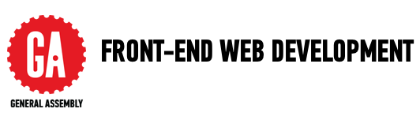

# GA Front-end Web Development 55

## Instructor

Your instructor is [Adriano Castro](https://www.linkedin.com/in/adrianocastro/). He can be reached directly [via Slack](https://fewd-sf-55.slack.com/messages/@adrianocastro). Alternatively, you can also reach him [via email](mailto:ad@adrianocastro.net).

## Office Hours

TBD

## Course Dates

The course starts on 03/30 and ends on 06/06. Classes take place every Tuesday and Thursday from 6:30pm - 9:30pm.

**Note:** There will be a substitute instructor on 04/18 and 04/20.

## Course Materials

All course materials and assignments are hosted in this Github repository.

Lessons, assignments and other resources are organised following this folder structure:

    .
    ├── lessons                     # folder containing all lesson materials
    │   └── 01                      # lesson number
    │      └── assignment           # lesson assignment
    │          └── 01-html-basics   # numbered assignment and topic
    │              ├── design_mocks # design mocks for assignment
    │              ├── solution     # solution for assignment (if provided)
    │              ├── starter_code # starter code (if provided)
    │              └── README.md    # assignment instructions
    ├── resources                   # miscellaneous resources for students (code, etc)
    └── ...

