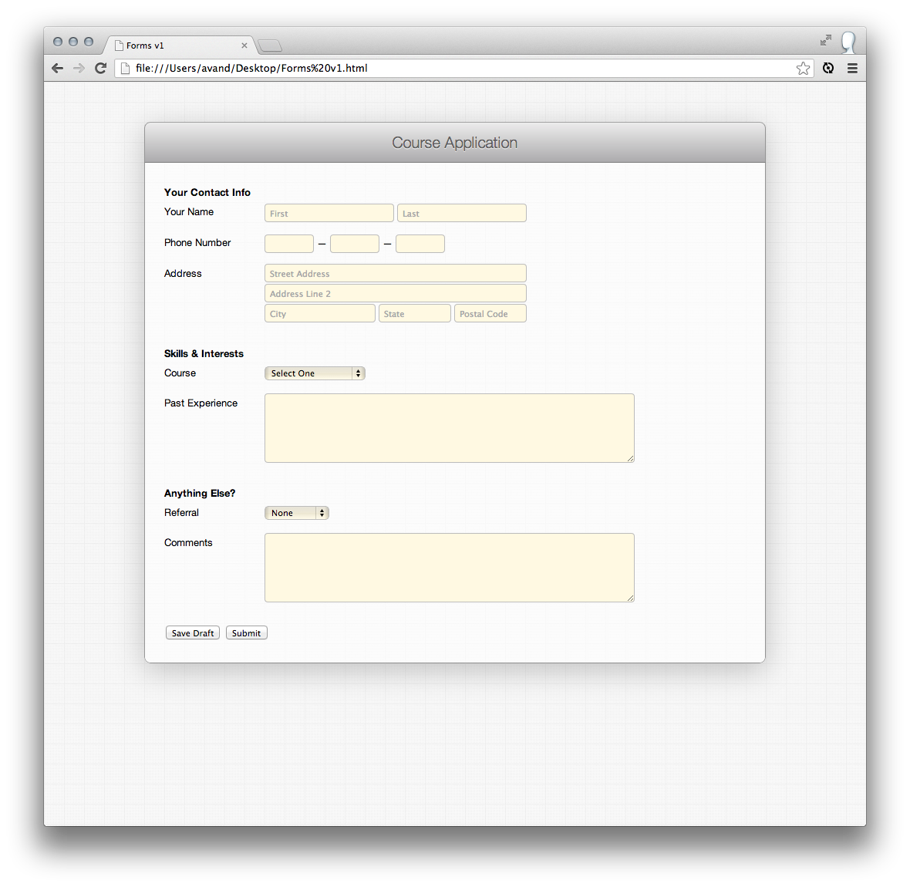

# FEWD Assignment #14: Course Application Form

## Description

Using all the new form elements you’ve learnt, build the following Course Application Form:

Please refer to the (rest of the mocks)[design_mocks] for more details.

We also included a [working demo](solution/index.html) for reference.

---

## Real-World Applications

- Build fully featured, semantic forms
- Apply CSS styles to create a modern web form
- Leverage labels, fieldsets and legends as ways of making forms more accessible

---

## Technical Requirements 

- Use fieldsets and legends to group form items together
- Use labels to improve the semantics and usability of the form
- Style form elements using CSS

## Bonus

- Make the name, phone number and course fields required
- Create a page that receives the form input and says “Thank you, {first name}. Your application to {course name} has been received.”

---

## Evaluation / Submission

Please submit your work via your class GitHub repository.

The file should be inside the `assignments/14-course-application-form` folder.

The instructional team will grade each technical requirement and provide a numeric grade on a scale: does not meet expectations (0); meets expectations (1); exceeds expectations (2).
